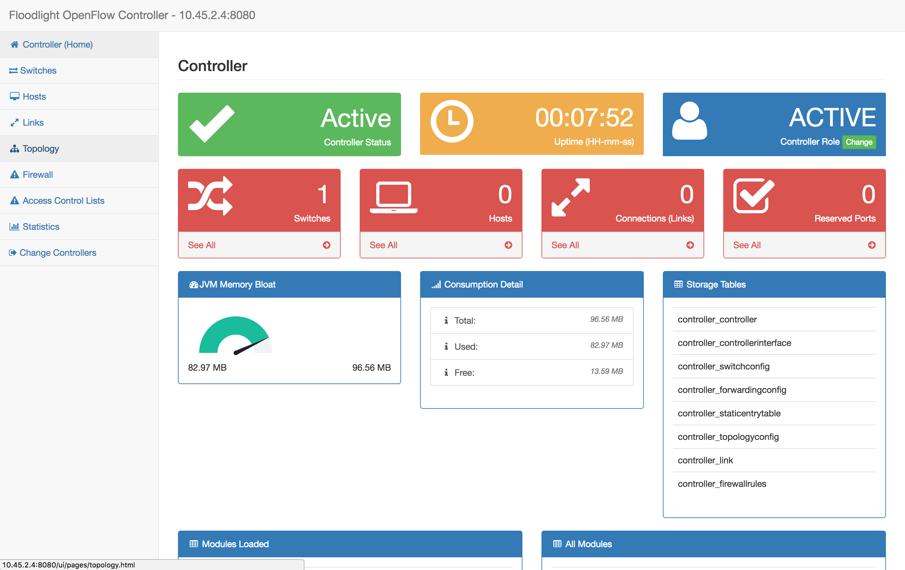
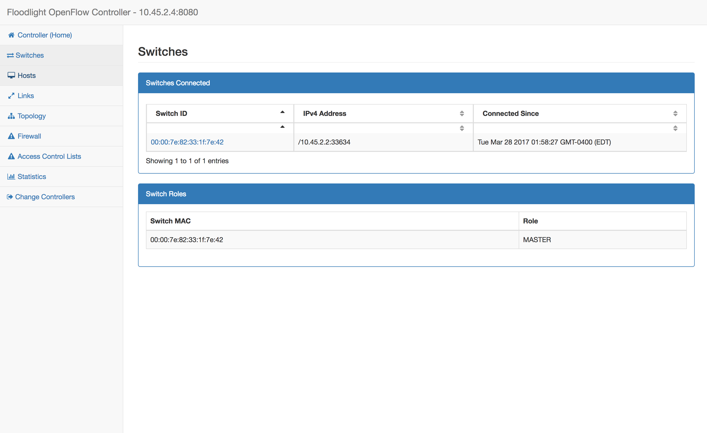

# SuperSDN

DNS Capabilities via Software-Defined Networking

## Getting Started

These instructions will get you a copy of the project up and running on your local machine for development and testing purposes. See deployment for notes on how to deploy the project on a live system.

### Prerequisites

What you need to have before installing SuperSDN

 - 4 Ubuntu 16.04 virtual machines conncted to the same network

 	* Host 1 for the client
 	* Host 2 for the Gateway
  	* Host 3 for the Real Web server
  	* Host 4 for the machine that runs the OpenFlow controller, DNS server, and Honeypot DNS server.

### Installing

Configure IP addresses for virtual machines

On Host 1, edit /etc/network/interfaces
  
 ```
# This file describes the network interfaces available on your system
# and how to activate them. For more information, see interfaces(5).
# The loopback network interface
auto lo
iface lo inet loopback
	
auto eth0
auto eth0:0
	
iface eth0 inet dhcp
	
iface eth0:0 inet static
address 10.45.2.33
netmask 255.255.255.224
#metric 100
up route add -net 10.45.2.128 netmask 255.255.255.128 gw 10.45.2.34 metric 100
 ```
  
  On Host 2, edit /etc/network/interfaces

```
# This file describes the network interfaces available on your system
# and how to activate them. For more information, see interfaces(5).

# The loopback network interface
auto lo
iface lo inet loopback

auto eth0
iface eth0 inet dhcp

auto eth0:0
iface eth0:0 inet static
address 10.45.2.34
netmask 255.255.255.224

auto eth0:1
iface eth0:1 inet static
address 10.45.2.65
netmask 255.255.255.224

auto eth0:2
iface eth0:2 inet static
address 10.45.2.97
netmask 255.255.255.224
```

On Host 3, edit /etc/network/interfaces

```
# This file describes the network interfaces available on your system
# and how to activate them. For more information, see interfaces(5).

# The loopback network interface
auto lo
iface lo inet loopback

auto eth0
iface eth0 inet dhcp

auto eth0:0

iface eth0 inet static
address 10.45.2.66
netmask 255.255.255.224
up route add -net 10.45.2.0 netmask 255.255.255.128 gw 10.45.2.65 metric 10

iface eth0:0 inet static
address 10.45.2.200
netmask 255.255.255.0
```

On Host 4, edit /etc/network/interfaces

```
# This file describes the network interfaces available on your system
# and how to activate them. For more information, see interfaces(5).

# The loopback network interface
auto lo
iface lo inet loopback

auto eth0
iface eth0 inet dhcp

iface eth0 inet static
address 10.45.2.98
netmask 255.255.255.224
```

Add IP aliases to each of these machines with CIDR prefix length of 27. 

| Host # | Original Address | Additional Alias(es)	 | Additional Static Routes                        |
| :-------: | :----------------------: | :--------------------------: | :----------------------------------------------------: |
| 1 	      | 10.45.x.1               | 10.45.x33/27             | 10.45.x128/25 via gateway 10.45.x.34 |
| 2  	      | 10.45.x.2		| 10.45.x.34/27 <br/>10.45.x.65/27 <br/> 10.45.x.97/27 |      |
| 3          | 10.45.x.3		| 10.45.x.66/27           | 10.45.x.0/25 via gateway 10.45.x.65     |
| 4 	      | 10.45.x.4 		| 10.45.x.98/27	      |	                                                                      |

Install apache on Host 3 and Host 4

```
sudo apt-get install apache2
```

Edit  /var/www/html/index.html on Host 3 to indicate it's real server

```
<!Doctype html> 
<html><head>
<title>Real Server</title>
</head>
<body cz-shortcut-listen="true">
<h1>This is the <strong style="color:green">Real Server</strong></h1>
```

Edit  /var/www/html/index.html on Host 4 to indicate it's Honeypot

```
<!Doctype html> 
<html><head>
<title> HoneyPot </title>
</head>
<body cz-shortcut-listen="true">
<h1>This is the <strong style="color:red">HoneyPot</strong></h1>
```

---

Install bind9 on Host 4

```
sudo apt-get install bind9
```

Edit /etc/bind/named.conf.local to

```
zone "example.com" {
    type master;
    file "/etc/bind/zones/db.example.com"; # zone file path
};
```

Create zone file

```
sudo mkdir /etc/bind/zones
cd /etc/bind/zones
```

Copy ../db.local to ./db.example.com

```
sudo cp ../db.local ./db.example.com
```

Edit /etc/bind/zones/db.example.com to

```
;
; BIND data file for local loopback interface
;
$TTL    10
@       IN      SOA     example.com. admin.example.com. (
                               4        ; Serial
                              10        ; Refresh
                          86400         ; Retry
                        2419200         ; Expire
                         604800 )       ; Negative Cache TTL

; name servers - NS records
    IN      NS      ns1. example.com.

; name servers - A records
ns1.example.com.             		 IN      A      10.45.2.4

; A records
www.example.com.            		 IN      A      10.45.1.10
```

Check BIND Configuration Syntax

```
sudo named-checkconf
sudo named-checkzone example.com db.example.com
```

---

--- 

Download and initialize Floodlight on local machine

```
git clone git://github.com/floodlight/floodlight.git
cd floodlight
git submodule init
git submodule update
```

Compress Floodlight folder and upload the zip file to Host 4

```
cd ../
zip -r floodlight.zip floodlight
scp floodlight.zip user@x.x.x.x:/home/user
```

Unzip floodlight on Host 4

```
sudo apt-get install unzip
unzip floodlight.zip
```

Install build tools

```
sudo apt-get install build-essential ant maven python-dev default-jdk
```

Change floodlight source directory privillege

```
sudo chmod -R 777 floodlight
```

Install Floodlight on Host 4

```
cd floodlight
ant
sudo mkdir /var/lib/floodlight
sudo chmod 777 /var/lib/floodlight
```

Create floodlight system service for it running in background

Edit /etc/systemd/system/floodlight.service

```
[Unit]
Description=Floodlight Service

[Service]
Type=simple
WorkingDirectory=/home/cs4516/floodlight
ExecStart=/usr/bin/java -jar target/floodlight.jar
```

Reload service

```
sudo systemctl daemon-reload
```

Start floodlight service

```
sudo service floodlight start
```

Check floodlight standdard status

```
sudo service floodlight status
```


Check floodlight standdard output

```
sudo journalctl -u floodlight
```

Visit http://10.45.2.4:8080/ui/pages/index.html in broswer



---

Install Open vSwitch on Host 3

```
sudo apt-get install openvswitch-switch
```

Start openvswitch-switch service

```
sudo service openvswitch-switch start
```

Add a bridge to openvswitch

```
sudo ovs-vsctl add-br openflow_bridge
```

Add network interface eth0:0, eth0:1 and eth0:2  to the openflow_bridge

```
sudo ovs-vsctl add-port openflow_bridge eth0:0
sudo ovs-vsctl add-port openflow_bridge eth0:1
sudo ovs-vsctl add-port openflow_bridge eth0:2
```

Attach openvswitch to floodlight controller. Port number can be find in floodlight standard output.

```
sudo ovs-vsctl set-controller openflow_bridge tcp:10.45.2.98:6653
```

Show bridge info

```
sudo ovs-vsctl show
```

Example bride info

```
Bridge openflow_bridge
        Controller "tcp:10.45.2.98:6653"
            is_connected: true
        Port "eth0:1"
            Interface "eth0:1"
        Port openflow_bridge
            Interface openflow_bridge
                type: internal
        Port "eth0:0"
            Interface "eth0:0"
        Port "eth0:2"
            Interface "eth0:2"
    ovs_version: "2.0.2"
```



## Built With

* [Apache](https://httpd.apache.org/docs/2.4) - The web server
* [Bind9](http://www.bind9.net) - The DNS server
* [Open vSwitch](http://openvswitch.org) - The virtual switch
* [Floodlight](http://www.projectfloodlight.org) - The OpenFlow controller

## Contributing

Please read [CONTRIBUTING.md](https://gist.github.com/PurpleBooth/b24679402957c63ec426) for details on our code of conduct, and the process for submitting pull requests to us.

## Versioning

We use [SemVer](http://semver.org/) for versioning. For the versions available, see the [tags on this repository](https://github.com/byliuyang/SuperSDN/tags). 

## Authors

* **Harry Liu** - *Initial work* - [byliuyang](https://github.com/byliuyang)
* **Can Alper** - *Initial work* - [calper95](https://github.com/calper95)

See also the list of [contributors](https://github.com/byliuyang/SuperSDN/contributors) who participated in this project.

## License

This project is licensed under the MIT License - see the [LICENSE.md](LICENSE.md) file for details

## Acknowledgments

* Project idea borrowed from Professor Craig Shue@WPI
